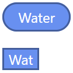

# Pokemon Types CSS

### About

Pokemon Types CSS is an ultra light weight CSS library for displaying pokemon types in little pills of their correct colors.

### CDN

##### Human Readable

https://raw.githubusercontent.com/justingolden21/pokemon-types-css/master/types.css

3.36kb

##### Minified

https://raw.githubusercontent.com/justingolden21/pokemon-types-css/master/types.min.css

2.64kb

### Usage

1. Add the CDN to the head of your HTML page

`<link rel="stylesheet" href="https://raw.githubusercontent.com/justingolden21/pokemon-types-css/master/types.min.css">`

2. Add HTML spans for the types you want (directly inside your HTML or add dynamically with JS)

``

or:

``

That's it!

### Preview

### Colors

All colors used are the official Pokemon colors as found on (Bulbapedia)[https://bulbapedia.bulbagarden.net/wiki/Category:Type_color_templates]

As of March 2020, there are 18 Pokemon Types.

| Type     | Color   | Dark Color |
|----------|---------|------------|
| Normal   | #A8A878 | #6D6D4E    |
| Fire     | #F08030 | #9C531F    |
| Water    | #6890F0 | #445E9C    |
| Electric | #F8D030 | #A1871F    |
| Grass    | #78C850 | #4E8234    |
| Ice      | #98D8D8 | #638D8D    |
| Fighting | #C03028 | #7D1F1A    |
| Poison   | #A040A0 | #682A68    |
| Ground   | #E0C068 | #927D44    |
| Flying   | #A890F0 | #6D5E9C    |
| Psychic  | #F85888 | #A13959    |
| Bug      | #A8B820 | #6D7815    |
| Rock     | #B8A038 | #786824    |
| Ghost    | #705898 | #493963    |
| Dragon   | #7038F8 | #4924A1    |
| Dark     | #705848 | #49392F    |
| Steel    | #B8B8D0 | #787887    |
| Fairy    | #EE99AC | #9B6470    |

### About

* Types are non-selectable

* Small file size

* One file

* No Javascript

Made by (Justin Golden)[https://justingolden.me/]

Minified with (CSS Minifier)[https://cssminifier.com/]
